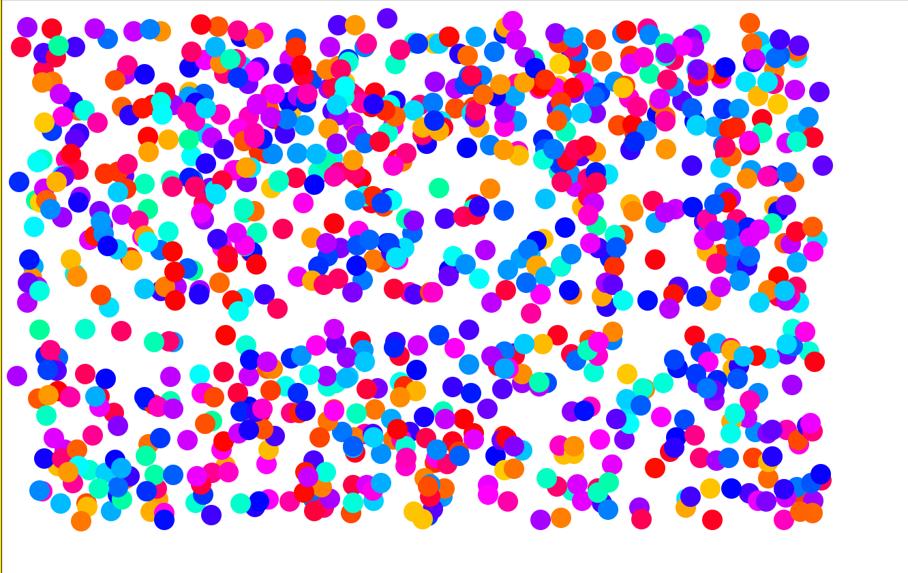

# Ball Animation in JavaScript

This project is an implementation of an animated number of balls using just JavaScript.

A random number of balls are created using DOM elements. A div is created with necessary styles
to set shape as a circle like border-radius, all balls are added to body. setInterval instruction is used to animate 
all balls changing each position and color in period of time determined.

## Installation

Download the repositore and drag an drop index.html file into the browser.

## Examples

Currently, there is one example which generates 1000 random balls.

## Usage

Animation is executed after drag and drop index.html file in the browser.

## Support

Contact me via Email for any comment or question about code implementation.

## Roadmap

Add different patterns of movements.

## License

**MIT License**

Permission is hereby granted, free of charge, to any person obtaining
a copy of this software and associated documentation files (the
"Software"), to deal in the Software without restriction, including
without limitation the rights to use, copy, modify, merge, publish,
distribute, sublicense, and/or sell copies of the Software, and to
permit persons to whom the Software is furnished to do so, subject to
the following conditions:

The above copyright notice and this permission notice shall be
included in all copies or substantial portions of the Software.

THE SOFTWARE IS PROVIDED "AS IS", WITHOUT WARRANTY OF ANY KIND,
EXPRESS OR IMPLIED, INCLUDING BUT NOT LIMITED TO THE WARRANTIES OF
MERCHANTABILITY, FITNESS FOR A PARTICULAR PURPOSE AND
NONINFRINGEMENT. IN NO EVENT SHALL THE AUTHORS OR COPYRIGHT HOLDERS BE
LIABLE FOR ANY CLAIM, DAMAGES OR OTHER LIABILITY, WHETHER IN AN ACTION
OF CONTRACT, TORT OR OTHERWISE, ARISING FROM, OUT OF OR IN CONNECTION
WITH THE SOFTWARE OR THE USE OR OTHER DEALINGS IN THE SOFTWARE.
